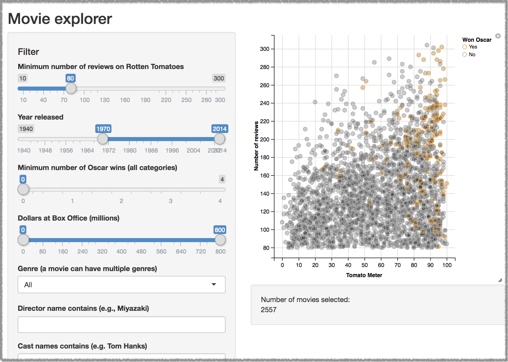

# cf-rshiny-demo

## What is this?

[R](https://www.r-project.org/), [Shiny](https://shiny.rstudio.com/), and [Cloud Foundry](https://www.cloudfoundry.org/) are an immensely powerful combination for developing and hosting data-analytics web applications. This sample shows how little is necessary to get an R Shiny application deployed in Cloud Foundry using the [R buildpack](https://docs.cloudfoundry.org/buildpacks/r/index.html).

## To run the demo

Clone this repository, go to the directory containing these files, ensure you're logged into Cloud Foundry, then push the application:
```
cf push
```

After a while of watching R modules compile, you'll see output similar to this:
```
Waiting for app to start...

name:              shiny-example
requested state:   started
routes:            shiny-example-kind-wallaby.app.cloud.gov
last uploaded:     Thu 14 Feb 00:28:58 PST 2019
stack:             cflinuxfs3
buildpacks:        r

type:            web
instances:       1/1
memory usage:    256M
start command:   R -f app.R
     state     since                  cpu    memory        disk         details
#0   running   2019-02-14T08:29:22Z   0.0%   44K of 256M   227M of 1G
```

Visit the listed route in your web browser to see the application in action. It should look like this:


## To run a different demo

Set the variable `EXAMPLE_NAME` in the application's environment to the [directory name](https://github.com/rstudio/shiny-examples) of the Shiny demo you'd like to run, then restart it:
```
cf set-env shiny-examples EXAMPLE_NAME <name-of-example> ; cf restart shiny-example
```
If you've selected an example which requires particular R packages to be installed, it may not work! In that case, you can edit r.yml to list the missing packages, then `cf push` to redeploy. 

If the example requires a lot of packages, you may find that the `cf` command is timing out before the application is fully deployed. You can set a longer timeout in minutes using the `CF_STAGING_TIMEOUT` environment variable before pushing the application:
```
CF_STAGING_TIMEOUT=30 cf push
```

## What each file does

- [`r.yml`](r.yml) specifies a CRAN repository and the R packages that the sample application needs to operate.
- [`Procfile`](Procfile) [tells the R buildpack what command to run](https://docs.cloudfoundry.org/buildpacks/r/index.html#start_command) to start the application.
- [`app.R`](app.R) contains some simple R code to check the environment for the `EXAMPLE_NAME` that the application should run (if supplied), then starts that example as an app listening on the `PORT` supplied by Cloud Foundry.
- [`manifest.yml`](manifest.yml) sets the name of the app and limits memory usage to 256M, and requests a random route to avoid collisions with other users running this sample in the same Cloud Foundry.
